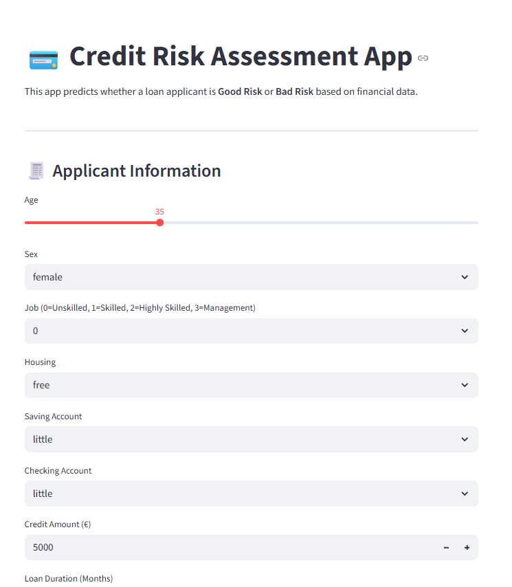

# 💳 Credit Risk Modelling with Streamlit & SHAP

This project presents a complete **Credit Risk Assessment System** built using **Machine Learning** and **Explainable AI (XAI)** methods.  
It predicts whether a loan applicant is a **Good Credit Risk** or **Bad Credit Risk**, helping financial institutions like **HSBC** make data-driven lending decisions.

The project includes **data preprocessing, feature engineering, model training, class imbalance handling**, and an interactive **Streamlit app** with **SHAP explainability**.

---

## 🚀 Key Highlights

✅ **Machine Learning Models**
- Logistic Regression (baseline)
- Random Forest Classifier
- XGBoost Classifier (optimized via RandomizedSearchCV and Optuna)

✅ **Feature Engineering**
- Loan-to-Income Ratio (LTI)
- Delinquent-Months-to-Loan-Months Ratio (DMTLM)
- Average Days Past Due (DPD) per Delinquent Month

✅ **Class Imbalance Handling**
- SMOTE (Synthetic Minority Oversampling)
- RandomUnderSampler for balanced comparison

✅ **Explainability (XAI)**
- SHAP summary plots for global feature importance
- SHAP force plots for local (instance-level) interpretation
- LIME (optional extension)

✅ **Streamlit Web App**
- User inputs borrower details → model predicts credit risk  
- Displays prediction, confidence score, and SHAP visualization  
- Deployed via Streamlit Community Cloud

---

## 🧩 Project Structure

credit_risk_modelling/
│
├── app.py # Streamlit application
├── cleaned_data.csv # Processed dataset
├── random_forest_model.pkl # Trained Random Forest model
├── xgboost_credit_pipeline.pkl# Tuned XGBoost model
├── encoder.pkl # Encoders for categorical variables
├── scaler.pkl # Scaler for numerical columns
├── requirements.txt # Dependencies
├── README.md # Project documentation
└── screenshots/
├── app_screenshot.png
└── shap_summary.png

---

## 🧠 End-to-End Workflow

1. **Data Preparation**  
   - Loaded `cleaned_data.csv`  
   - Dropped irrelevant columns (`cust_id`, `city`, `zipcode`, etc.)  
   - Created new engineered features (LTI, DMTLM, DPD)

2. **Feature Selection**  
   - Used Variance Inflation Factor (VIF) to handle multicollinearity  
   - Selected features with Information Value (IV ≥ 0.02)

3. **Model Training & Evaluation**  
   - Split data (80-20)  
   - Applied SMOTE to handle imbalance  
   - Tuned hyperparameters using RandomizedSearchCV and Optuna  
   - Evaluated using Accuracy, Recall, ROC-AUC, KS Statistic, and Gini Coefficient

4. **Explainable AI**  
   - Used SHAP to identify which factors drive risk predictions  
   - Visualized top contributors globally and locally

5. **Deployment**  
   - Built interactive **Streamlit app**  
   - Inputs borrower details → predicts creditworthiness  
   - Visualizes SHAP values for transparency

---

## 🖥️ Streamlit App Preview

### 🔹 Credit Risk Predictor Interface

### 🔹 SHAP Feature Importance Summary

> 💡 *To add screenshots:*  
> Save images in a `screenshots/` folder → commit → push to GitHub.

---

